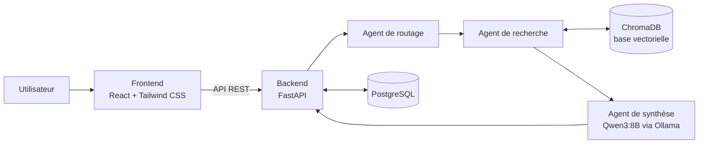

<div align="center">

# 🎓 Genove

**Plateforme e-learning avec assistant chatbot RAG multi-agents**

Catalogue de formations · Espace projets · Assistant IA qui répond à partir de vos documents, exécuté en local


</div>

---

## 📖 À propos

**Genove** est une plateforme e-learning pensée pour une startup EdTech. Elle réunit un catalogue de formations, un espace de projets partenaires et un **assistant intelligent** capable de répondre aux questions des utilisateurs à partir d'un corpus de documents.

L'assistant repose sur un pipeline **RAG** (*Retrieval-Augmented Generation*) piloté par **trois agents** spécialisés. Le modèle de langage et la base vectorielle tournent **en local** : aucune donnée n'est envoyée à un service d'IA externe.

## ✨ Fonctionnalités

| Module | Description |
|---|---|
| 🏢 **Présentation Startup** | Présentation de Genove, de sa mission et de son offre |
| 📚 **Catalogue Formations** | Parcours et formations disponibles sur la plateforme |
| 🤝 **Espace Projets** | Projets partenaires proposés aux apprenants |
| 💬 **Savoir+ Q&A** | Assistant IA qui répond aux questions à partir des documents indexés (pipeline RAG) |

## 🧠 Architecture



**Le pipeline RAG en bref :**

1. **Ingestion** : extraction du texte des PDF (PyPDF), découpage en *chunks*, calcul des embeddings avec `Qwen3-Embedding:0.6B`, stockage dans ChromaDB.
2. **Routage** : l'agent de routage analyse la question de l'utilisateur.
3. **Recherche** : l'agent de recherche récupère les passages les plus pertinents dans ChromaDB.
4. **Synthèse** : l'agent de synthèse génère la réponse avec `Qwen3:8B` exécuté localement via Ollama.

## 🛠️ Stack technique

| Couche | Technologies |
|---|---|
| **Frontend** | React, TypeScript, TanStack Start, Vite, Tailwind CSS |
| **Backend** | Python, FastAPI |
| **Base de données** | PostgreSQL (données de la plateforme, conversations et messages) |
| **Base vectorielle** | ChromaDB (locale) |
| **IA / LLM** | Ollama, Qwen3:8B (génération), Qwen3-Embedding:0.6B (embeddings) |
| **Traitement de documents** | PyPDF |

## 📁 Structure du projet

```text
Genove/
├── Backend/
│   ├── main.py              # Point d'entrée de l'API FastAPI
│   ├── chatbot_cli.py       # Chatbot en ligne de commande
│   ├── agents/              # Agents (routage, recherche, synthèse)
│   ├── rag/                 # Pipeline RAG (extraction, chunking, embeddings, indexation)
│   ├── routes/              # Routes de l'API
│   ├── database/            # Connexion à PostgreSQL
│   ├── tests/               # Tests
│   ├── data/                # Documents à indexer et index ChromaDB (générés en local)
│   └── requirements.txt
├── Frontend/
│   ├── src/                 # Routes, composants, hooks, lib
│   └── package.json
└── README.md
```

## 🚀 Installation

### Prérequis

- [Python](https://www.python.org/downloads/) 3.10 ou plus
- [Node.js](https://nodejs.org/) 18 ou plus
- [PostgreSQL](https://www.postgresql.org/download/)
- [Ollama](https://ollama.com/download)

### 1. Cloner le dépôt

```bash
git clone https://github.com/amenallahnjima15/Genove.git
cd Genove
```

### 2. Télécharger les modèles Ollama

```bash
ollama pull qwen3:8b
ollama pull qwen3-embedding:0.6b
```

### 3. Lancer le Backend

```bash
cd Backend
python -m venv venv
venv\Scripts\activate          # Linux / macOS : source venv/bin/activate
pip install -r requirements.txt
```

Crée ton fichier d'environnement à partir de l'exemple, puis renseigne tes identifiants PostgreSQL :

```bash
copy .env.example .env         # Linux / macOS : cp .env.example .env
```

```env
DATABASE_URL=postgresql://<username>:<password>@localhost:5432/<database>
```

Place tes documents PDF dans `Backend/data/`, construis l'index vectoriel, puis démarre l'API :

```bash
python -m rag.indexation
uvicorn main:app --reload
```

### 4. Lancer le Frontend

Dans un second terminal :

```bash
cd Frontend
npm install
copy .env.example .env         # Linux / macOS : cp .env.example .env
npm run dev
```

L'application est ensuite accessible dans le navigateur à l'adresse indiquée par Vite.

## 🧪 Tests

`Backend/tests/test_agents.py` teste les agents de bout en bout. Il **nécessite** qu'Ollama et PostgreSQL soient lancés et que l'index ChromaDB soit déjà construit (il n'utilise pas de mocks).

```bash
cd Backend
python -m pytest tests/test_agents.py
```

## 📌 État du projet

- ✅ Les quatre modules frontend sont développés.
- ✅ L'intégration complète fonctionne : Frontend → Backend → RAG → ChromaDB → Ollama → Backend → Frontend.
- 🔍 Les tests ont été réalisés principalement à la main (frontend, API, chaque étape du pipeline, questions dans et hors du périmètre documentaire).
- ⚠️ Projet de stage : c'est un prototype fonctionnel, pas une version de production. La configuration CORS n'autorise que `localhost`, et le modèle Qwen3:8B demande une machine avec suffisamment de mémoire.

<!--
## 📸 Aperçu

Ajoute tes captures dans docs/screenshots/, puis décommente ces lignes :


-->

## 🎓 Contexte et auteur

Projet réalisé lors d'un stage d'été (juillet – août 2026) chez **Genove**, startup EdTech, dans le cadre d'une formation en Business Computing à l'**ESEN Manouba** (Tunisie).

**Amen Allah Njima** · [LinkedIn](https://www.linkedin.com/in/amen-allah-njima-8443b5341) · [GitHub](https://github.com/amenallahnjima15)

## 📄 Licence

Dépôt publié à titre de démonstration (portfolio). Sans licence explicite, tous droits réservés : contacte l'auteur pour toute réutilisation.
